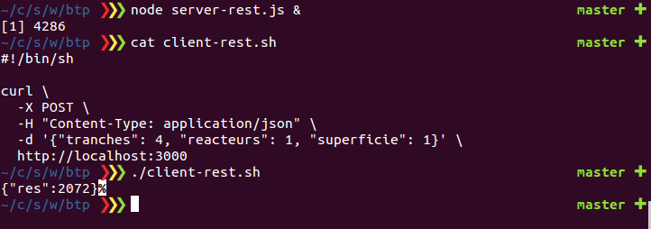

## Coog REST Example

Some example scripts to:

- Query coog / tryton server via RPC interface
- Launch a REST server to expose business service (example)
- Query the REST server (curl)

### Usage

- `npm i`
- `npm run client-rpc`
- `npm run server-rest`
- `npm run client-rest`

Theses scripts are **just examples**, they could be helpful to start mounting
REST services based on coog / tryton on Nodejs

### Examples

