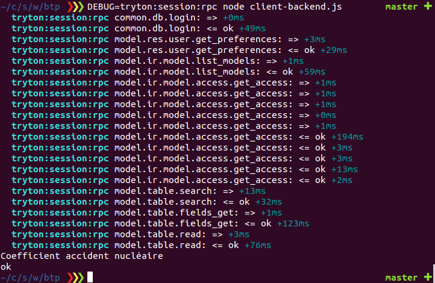

## Coog Hacks

This is a kind of index of useful scripts to interact with Coog.

Examples are based on:

- [tryton-session](https://github.com/coopengo/tryton-session)
- [tryton-session-llt](https://github.com/coopengo/tryton-session-llt)
- [tryton-model](https://github.com/coopengo/tryton-model)

**Please keep in mind that these are just examples to make it easy to start an interface**

### Usage

```
- npm i
- node <script-name>
```

Please note that:

- Server URL, DB, USERNAME and PASSWORD could be set from environment variables
    - `COOG_URL`, `COOG_DB`, `COOG_USERNAME`, `COOG_PASSWORD`
    - Example: `COOG_URL=http://myserver.local:8000 node <script-name>`

- To log internal actions, you can activate debug on nodejs client libs
    - `DEBUG=tryton:session:* node <script-name>`

    

- To debug scripts execution, you can use [node inspector](https://github.com/node-inspector/node-inspector)

### Examples

- Expose a REST API based on Coog: [server](./rest-server.js) and [client](./rest-client)
- Generate a loans report: [script](./report.js)
